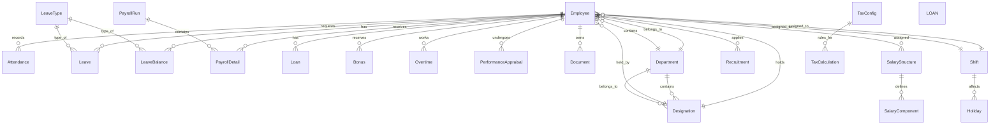
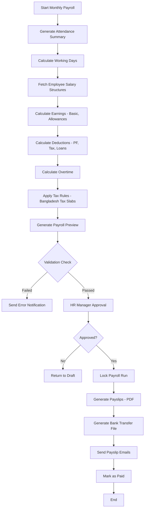
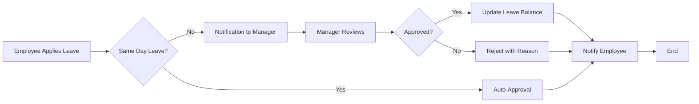

# HR & Payroll Management System - Architecture Design

## Executive Summary

A comprehensive enterprise-grade HR & Payroll Management System built with ASP.NET Core MVC 8, Entity Framework Core 8, and SQL Server, following Clean Architecture principles. The system includes all core HR modules (Employee Management, Attendance, Leave, Payroll, Recruitment, Performance Appraisal, ESS Portal) with Bangladesh tax rules as default.

**Technology Stack:**
- **Framework:** .NET 8 (LTS)
- **ORM:** Entity Framework Core 8
- **Database:** SQL Server 2019+
- **UI:** AdminLTE 3.x + Bootstrap 5
- **Authentication:** ASP.NET Core Identity
- **Validation:** FluentValidation
- **Mapping:** AutoMapper
- **PDF Generation:** QuestPDF or iTextSharp
- **Excel Export:** EPPlus or ClosedXML
- **Logging:** Serilog

---

## 1. Solution Architecture

### 1.1 Clean Architecture Layers

```
┌─────────────────────────────────────────────────────────────────┐
│                        Presentation Layer                        │
│  ┌───────────────────────────────────────────────────────────┐  │
│  │                  HRPayroll.Web (MVC)                       │  │
│  │  • Controllers / Views / ViewComponents                    │  │
│  │  • Filters / Middleware / Configuration                    │  │
│  │  • ViewModels / Model Binders                              │  │
│  └───────────────────────────────────────────────────────────┘  │
├─────────────────────────────────────────────────────────────────┤
│                       Application Layer                          │
│  ┌───────────────────────────────────────────────────────────┐  │
│  │                HRPayroll.Application                       │  │
│  │  • DTOs / ViewModels                                      │  │
│  │  • Interfaces / Service Implementations                   │  │
│  │  • Validators / Behaviors / Pipelines                     │  │
│  │  • AutoMapper Profiles                                    │  │
│  └───────────────────────────────────────────────────────────┘  │
├─────────────────────────────────────────────────────────────────┤
│                        Domain Layer                              │
│  ┌───────────────────────────────────────────────────────────┐  │
│  │                 HRPayroll.Domain                           │  │
│  │  • Entities / Aggregate Roots                            │  │
│  │  • Interfaces (Repository Contracts)                     │  │
│  │  • Enums / Value Objects / Domain Events                  │  │
│  │  • Specifications                                         │  │
│  └───────────────────────────────────────────────────────────┘  │
├─────────────────────────────────────────────────────────────────┤
│                     Infrastructure Layer                         │
│  ┌───────────────────────────────────────────────────────────┐  │
│  │               HRPayroll.Infrastructure                    │  │
│  │  • DbContext / Migrations / Configurations               │  │
│  │  • Repository Implementations                             │  │
│  │  • Identity / Authentication Services                     │  │
│  │  • File Storage / External Services                       │  │
│  │  • Logging / Auditing                                     │  │
│  └───────────────────────────────────────────────────────────┘  │
└─────────────────────────────────────────────────────────────────┘
```

### 1.2 Project Structure

```
hrpayroll/
├── src/
│   ├── HRPayroll.Domain/
│   │   ├── Common/
│   │   │   ├── BaseEntity.cs
│   │   │   ├── Entity.cs
│   │   │   ├── AuditableEntity.cs
│   │   │   └── ValueObject.cs
│   │   ├── Entities/
│   │   │   ├── HR/
│   │   │   │   ├── Employee.cs
│   │   │   │   ├── Department.cs
│   │   │   │   ├── Designation.cs
│   │   │   │   ├── Attendance.cs
│   │   │   │   ├── Leave.cs
│   │   │   │   ├── LeaveBalance.cs
│   │   │   │   ├── Shift.cs
│   │   │   │   ├── Holiday.cs
│   │   │   │   ├── Recruitment.cs
│   │   │   │   ├── Onboarding.cs
│   │   │   │   └── PerformanceAppraisal.cs
│   │   │   └── Payroll/
│   │   │       ├── SalaryStructure.cs
│   │   │       ├── SalaryComponent.cs
│   │   │       ├── PayrollRun.cs
│   │   │       ├── PayrollDetail.cs
│   │   │       ├── TaxConfig.cs
│   │   │       ├── TaxCalculation.cs
│   │   │       ├── Loan.cs
│   │   │       ├── Bonus.cs
│   │   │       └── Overtime.cs
│   │   ├── Enums/
│   │   │   ├── EmployeeStatus.cs
│   │   │   ├── LeaveStatus.cs
│   │   │   ├── LeaveType.cs
│   │   │   ├── AttendanceStatus.cs
│   │   │   ├── PaymentFrequency.cs
│   │   │   ├── ComponentType.cs
│   │   │   └── UserRole.cs
│   │   ├── Interfaces/
│   │   │   ├── IRepository.cs
│   │   │   ├── IUnitOfWork.cs
│   │   │   ├── IServices/
│   │   │   │   ├── IEmployeeService.cs
│   │   │   │   ├── IAttendanceService.cs
│   │   │   │   ├── ILeaveService.cs
│   │   │   │   ├── IPayrollService.cs
│   │   │   │   ├── ITaxService.cs
│   │   │   │   └── IReportService.cs
│   │   │   └── ICurrentUser.cs
│   │   └── Specifications/
│   │       ├── EmployeeSpecification.cs
│   │       └── AttendanceSpecification.cs
│   │
│   ├── HRPayroll.Application/
│   │   ├── DTOs/
│   │   │   ├── EmployeeDTO.cs
│   │   │   ├── AttendanceDTO.cs
│   │   │   ├── LeaveDTO.cs
│   │   │   ├── PayrollDTO.cs
│   │   │   ├── ReportDTO.cs
│   │   │   └── CommonDTO.cs
│   │   ├── Profiles/
│   │   │   └── MappingProfile.cs
│   │   ├── Services/
│   │   │   ├── EmployeeService.cs
│   │   │   ├── AttendanceService.cs
│   │   │   ├── LeaveService.cs
│   │   │   ├── PayrollService.cs
│   │   │   ├── TaxService.cs
│   │   │   └── ReportService.cs
│   │   ├── Validators/
│   │   │   ├── EmployeeValidator.cs
│   │   │   ├── LeaveValidator.cs
│   │   │   ├── PayrollValidator.cs
│   │   │   └── CommonValidator.cs
│   │   ├── Behaviors/
│   │   │   ├── LoggingBehavior.cs
│   │   │   └── ValidationBehavior.cs
│   │   └── DependencyInjection.cs
│   │
│   ├── HRPayroll.Infrastructure/
│   │   ├── Data/
│   │   │   ├── AppDbContext.cs
│   │   │   ├── Configurations/
│   │   │   │   ├── EmployeeConfiguration.cs
│   │   │   │   ├── DepartmentConfiguration.cs
│   │   │   │   └── ...
│   │   │   └── Interceptors/
│   │   │       └── AuditableEntityInterceptor.cs
│   │   ├── Repositories/
│   │   │   ├── Repository.cs
│   │   │   ├── EmployeeRepository.cs
│   │   │   ├── AttendanceRepository.cs
│   │   │   └── UnitOfWork.cs
│   │   ├── Identity/
│   │   │   ├── ApplicationUser.cs
│   │   │   ├── ApplicationRole.cs
│   │   │   ├── ApplicationUserClaim.cs
│   │   │   └── ApplicationUserToken.cs
│   │   ├── Services/
│   │   │   ├── FileStorageService.cs
│   │   │   ├── EmailService.cs
│   │   │   ├── PdfGeneratorService.cs
│   │   │   └── BankExportService.cs
│   │   ├── Logging/
│   │   │   └── SerilogLogger.cs
│   │   └── DependencyInjection.cs
│   │
│   └── HRPayroll.Web/
│       ├── Controllers/
│       │   ├── HomeController.cs
│       │   ├── EmployeeController.cs
│       │   ├── AttendanceController.cs
│       │   ├── LeaveController.cs
│       │   ├── PayrollController.cs
│       │   ├── ReportController.cs
│       │   ├── AdminController.cs
│       │   └── ESS/
│       │       └── EmployeePortalController.cs
│       ├── Views/
│       │   ├── Shared/
│       │   │   ├── _Layout.cshtml
│       │   │   ├── _Sidebar.cshtml
│       │   │   ├── _Header.cshtml
│       │   │   └── _Footer.cshtml
│       │   ├── Home/
│       │   │   ├── Dashboard.cshtml
│       │   │   └── Index.cshtml
│       │   ├── Employee/
│       │   │   ├── Index.cshtml
│       │   │   ├── Create.cshtml
│       │   │   ├── Edit.cshtml
│       │   │   └── Details.cshtml
│       │   └── ...
│       ├── ViewComponents/
│       │   ├── SidebarViewComponent.cs
│       │   ├── NotificationViewComponent.cs
│       │   └── StatisticsViewComponent.cs
│       ├── Models/
│       │   └── ViewModels/
│       │       ├── DashboardVM.cs
│       │       └── ...
│       ├── wwwroot/
│       │   ├── css/
│       │   ├── js/
│       │   ├── lib/
│       │   │   ├── admin-lte/
│       │   │   ├── bootstrap/
│       │   │   ├── jquery/
│       │   │   └── ...
│       │   └── uploads/
│       │       ├── employees/
│       │       └── documents/
│       ├── Program.cs
│       ├── appsettings.json
│       └── _ViewImports.cshtml
│
├── tests/
│   ├── HRPayroll.Application.Tests/
│   │   ├── Services/
│   │   │   └── EmployeeServiceTests.cs
│   │   └── Usings.cs
│   └── HRPayroll.Domain.Tests/
│       └── Entities/
│           └── EmployeeTests.cs
│
├── docs/
│   ├── API.md
│   ├── DATABASE.md
│   └── DEPLOYMENT.md
│
├── scripts/
│   ├── migration.sql
│   └── seed.sql
│
└── HRPayroll.sln
```

---

## 2. Database Schema Design

### 2.1 Entity Relationship Diagram



### 2.2 Core Tables

#### 2.2.1 Employees Table
```sql
CREATE TABLE Employees (
    Id BIGINT IDENTITY(1,1) PRIMARY KEY,
    EmployeeCode NVARCHAR(20) NOT NULL UNIQUE,
    FirstName NVARCHAR(50) NOT NULL,
    LastName NVARCHAR(50) NOT NULL,
    Email NVARCHAR(100) NOT NULL UNIQUE,
    Phone NVARCHAR(20),
    DateOfBirth DATE,
    Gender NVARCHAR(10),
    MaritalStatus NVARCHAR(20),
    NationalId NVARCHAR(20),
    TinNo NVARCHAR(20),
    PassportNo NVARCHAR(20),
    BloodGroup NVARCHAR(5),
    PresentAddress NVARCHAR(500),
    PermanentAddress NVARCHAR(500),
    ProfilePhoto NVARCHAR(255),
    DepartmentId BIGINT NOT NULL,
    DesignationId BIGINT NOT NULL,
    ShiftId BIGINT,
    SupervisorId BIGINT,
    DateOfJoining DATE NOT NULL,
    DateOfConfirmation DATE,
    DateOfResignation DATE,
    EmploymentType NVARCHAR(20), -- Permanent, Contract, Intern
    Status NVARCHAR(20) NOT NULL, -- Active, Inactive, OnLeave, Terminated
    IsTaxExempted BIT DEFAULT 0,
    TaxIdentificationNo NVARCHAR(20),
    BankAccountNo NVARCHAR(50),
    BankName NVARCHAR(100),
    BranchName NVARCHAR(100),
    PFAccountNo NVARCHAR(50),
    GratuityNo NVARCHAR(50),
    CreatedAt DATETIME2 DEFAULT GETDATE(),
    UpdatedAt DATETIME2,
    CreatedBy BIGINT,
    UpdatedBy BIGINT,
    CONSTRAINT FK_Employees_Department FOREIGN KEY (DepartmentId) REFERENCES Departments(Id),
    CONSTRAINT FK_Employees_Designation FOREIGN KEY (DesignationId) REFERENCES Designations(Id),
    CONSTRAINT FK_Employees_Shift FOREIGN KEY (ShiftId) REFERENCES Shifts(Id),
    CONSTRAINT FK_Employees_Supervisor FOREIGN KEY (SupervisorId) REFERENCES Employees(Id)
);

CREATE INDEX IX_Employees_EmployeeCode ON Employees(EmployeeCode);
CREATE INDEX IX_Employees_Email ON Employees(Email);
CREATE INDEX IX_Employees_DepartmentId ON Employees(DepartmentId);
CREATE INDEX IX_Employees_Status ON Employees(Status);
CREATE INDEX IX_Employees_DateOfJoining ON Employees(DateOfJoining);
```

#### 2.2.2 Departments Table
```sql
CREATE TABLE Departments (
    Id BIGINT IDENTITY(1,1) PRIMARY KEY,
    Name NVARCHAR(100) NOT NULL,
    NameBN NVARCHAR(100),
    Code NVARCHAR(20) NOT NULL UNIQUE,
    Description NVARCHAR(500),
    ParentDepartmentId BIGINT,
    HeadOfDepartmentId BIGINT,
    IsActive BIT DEFAULT 1,
    CreatedAt DATETIME2 DEFAULT GETDATE(),
    UpdatedAt DATETIME2,
    CONSTRAINT FK_Departments_Parent FOREIGN KEY (ParentDepartmentId) REFERENCES Departments(Id),
    CONSTRAINT FK_Departments_HOD FOREIGN KEY (HeadOfDepartmentId) REFERENCES Employees(Id)
);

CREATE INDEX IX_Departments_Code ON Departments(Code);
CREATE INDEX IX_Departments_IsActive ON Departments(IsActive);
```

#### 2.2.3 Designations Table
```sql
CREATE TABLE Designations (
    Id BIGINT IDENTITY(1,1) PRIMARY KEY,
    Name NVARCHAR(100) NOT NULL,
    NameBN NVARCHAR(100),
    Code NVARCHAR(20) NOT NULL,
    DepartmentId BIGINT NOT NULL,
    Description NVARCHAR(500),
    Grade NVARCHAR(20),
    Level NVARCHAR(20),
    BaseSalary DECIMAL(18,2),
    IsActive BIT DEFAULT 1,
    CreatedAt DATETIME2 DEFAULT GETDATE(),
    UpdatedAt DATETIME2,
    CONSTRAINT FK_Designations_Department FOREIGN KEY (DepartmentId) REFERENCES Departments(Id)
);

CREATE INDEX IX_Designations_Code ON Designations(Code);
CREATE INDEX IX_Designations_DepartmentId ON Designations(DepartmentId);
```

#### 2.2.4 Attendance Table
```sql
CREATE TABLE Attendance (
    Id BIGINT IDENTITY(1,1) PRIMARY KEY,
    EmployeeId BIGINT NOT NULL,
    Date DATE NOT NULL,
    ClockInTime TIME,
    ClockOutTime TIME,
    WorkingHours DECIMAL(4,2),
    OvertimeHours DECIMAL(4,2),
    Status NVARCHAR(20) NOT NULL, -- Present, Absent, Late, HalfDay, Leave, Holiday
    LateMinutes INT,
    EarlyLeavingMinutes INT,
    BiometricDeviceId NVARCHAR(50),
    BiometricLogId NVARCHAR(100),
    EntryType NVARCHAR(20), -- Manual, Biometric, Auto
    ApprovedBy BIGINT,
    ApprovalDate DATETIME2,
    Remarks NVARCHAR(500),
    CreatedAt DATETIME2 DEFAULT GETDATE(),
    UpdatedAt DATETIME2,
    CONSTRAINT FK_Attendance_Employee FOREIGN KEY (EmployeeId) REFERENCES Employees(Id),
    CONSTRAINT FK_Attendance_ApprovedBy FOREIGN KEY (ApprovedBy) REFERENCES Employees(Id)
);

CREATE UNIQUE INDEX IX_Attendance_EmployeeDate ON Attendance(EmployeeId, Date);
CREATE INDEX IX_Attendance_Date ON Attendance(Date);
CREATE INDEX IX_Attendance_Status ON Attendance(Status);
CREATE INDEX IX_Attendance_EmployeeId ON Attendance(EmployeeId);
```

#### 2.2.5 Leave Types Table
```sql
CREATE TABLE LeaveTypes (
    Id BIGINT IDENTITY(1,1) PRIMARY KEY,
    Name NVARCHAR(50) NOT NULL,
    NameBN NVARCHAR(50),
    Code NVARCHAR(20) NOT NULL UNIQUE,
    Description NVARCHAR(500),
    IsPaidLeave BIT DEFAULT 1,
    IsCarryForwardAllowed BIT DEFAULT 0,
    MaxCarryForwardDays INT,
    MaxAccumulationDays INT,
    RequiresApproval BIT DEFAULT 1,
    RequiresDocument BIT DEFAULT 0,
    ColorCode NVARCHAR(10),
    IsActive BIT DEFAULT 1,
    CreatedAt DATETIME2 DEFAULT GETDATE(),
    UpdatedAt DATETIME2
);

CREATE INDEX IX_LeaveTypes_Code ON LeaveTypes(Code);
```

#### 2.2.6 Leaves Table
```sql
CREATE TABLE Leaves (
    Id BIGINT IDENTITY(1,1) PRIMARY KEY,
    EmployeeId BIGINT NOT NULL,
    LeaveTypeId BIGINT NOT NULL,
    StartDate DATE NOT NULL,
    EndDate DATE NOT NULL,
    TotalDays DECIMAL(4,2) NOT NULL,
    Reason NVARCHAR(500),
    Status NVARCHAR(20) NOT NULL, -- Pending, Approved, Rejected, Cancelled
    AppliedOn DATE NOT NULL,
    ApprovedBy BIGINT,
    ApprovalDate DATETIME2,
    ApprovalRemarks NVARCHAR(500),
    IsHalfDay BIT DEFAULT 0,
    HalfDayPortion NVARCHAR(10), -- Morning, Afternoon
    SupportingDocument NVARCHAR(255),
    CancellationReason NVARCHAR(500),
    CancelledBy BIGINT,
    CancelledDate DATETIME2,
    CreatedAt DATETIME2 DEFAULT GETDATE(),
    UpdatedAt DATETIME2,
    CONSTRAINT FK_Leaves_Employee FOREIGN KEY (EmployeeId) REFERENCES Employees(Id),
    CONSTRAINT FK_Leaves_LeaveType FOREIGN KEY (LeaveTypeId) REFERENCES LeaveTypes(Id),
    CONSTRAINT FK_Leaves_ApprovedBy FOREIGN KEY (ApprovedBy) REFERENCES Employees(Id)
);

CREATE INDEX IX_Leaves_EmployeeId ON Leaves(EmployeeId);
CREATE INDEX IX_Leaves_LeaveTypeId ON Leaves(LeaveTypeId);
CREATE INDEX IX_Leaves_Status ON Leaves(Status);
CREATE INDEX IX_Leaves_StartDate ON Leaves(StartDate);
CREATE INDEX IX_Leaves_AppliedOn ON Leaves(AppliedOn);
```

#### 2.2.7 Leave Balances Table
```sql
CREATE TABLE LeaveBalances (
    Id BIGINT IDENTITY(1,1) PRIMARY KEY,
    EmployeeId BIGINT NOT NULL,
    LeaveTypeId BIGINT NOT NULL,
    Year INT NOT NULL,
    TotalDays DECIMAL(4,2) NOT NULL,
    UsedDays DECIMAL(4,2) DEFAULT 0,
    PendingDays DECIMAL(4,2) DEFAULT 0,
    CarryForwardDays DECIMAL(4,2) DEFAULT 0,
    AvailableDays AS (TotalDays - UsedDays - PendingDays + CarryForwardDays) PERSISTED,
    CreatedAt DATETIME2 DEFAULT GETDATE(),
    UpdatedAt DATETIME2,
    CONSTRAINT FK_LeaveBalances_Employee FOREIGN KEY (EmployeeId) REFERENCES Employees(Id),
    CONSTRAINT FK_LeaveBalances_LeaveType FOREIGN KEY (LeaveTypeId) REFERENCES LeaveTypes(Id),
    CONSTRAINT UQ_LeaveBalances_EmployeeYearType UNIQUE (EmployeeId, LeaveTypeId, Year)
);

CREATE INDEX IX_LeaveBalances_EmployeeId ON LeaveBalances(EmployeeId);
CREATE INDEX IX_LeaveBalances_Year ON LeaveBalances(Year);
```

#### 2.2.8 Shifts Table
```sql
CREATE TABLE Shifts (
    Id BIGINT IDENTITY(1,1) PRIMARY KEY,
    Name NVARCHAR(50) NOT NULL,
    Code NVARCHAR(20) NOT NULL UNIQUE,
    StartTime TIME NOT NULL,
    EndTime TIME NOT NULL,
    BreakTimeMinutes INT DEFAULT 60,
    WorkingHours DECIMAL(4,2),
    GraceTimeMinutes INT DEFAULT 0,
    IsNightShift BIT DEFAULT 0,
    IsActive BIT DEFAULT 1,
    CreatedAt DATETIME2 DEFAULT GETDATE(),
    UpdatedAt DATETIME2
);

CREATE INDEX IX_Shifts_Code ON Shifts(Code);
```

#### 2.2.9 Holidays Table
```sql
CREATE TABLE Holidays (
    Id BIGINT IDENTITY(1,1) PRIMARY KEY,
    Name NVARCHAR(100) NOT NULL,
    NameBN NVARCHAR(100),
    Date DATE NOT NULL,
    DayOfWeek NVARCHAR(10),
    Type NVARCHAR(20), -- National, Festival, Optional
    Description NVARCHAR(500),
    IsRepeatAnnually BIT DEFAULT 0,
    Country NVARCHAR(50) DEFAULT 'Bangladesh',
    CreatedAt DATETIME2 DEFAULT GETDATE(),
    UpdatedAt DATETIME2
);

CREATE INDEX IX_Holidays_Date ON Holidays(Date);
CREATE INDEX IX_Holidays_Type ON Holidays(Type);
```

#### 2.2.10 Salary Structures Table
```sql
CREATE TABLE SalaryStructures (
    Id BIGINT IDENTITY(1,1) PRIMARY KEY,
    Name NVARCHAR(100) NOT NULL,
    Code NVARCHAR(20) NOT NULL UNIQUE,
    Description NVARCHAR(500),
    EmployeeId BIGINT, -- NULL if template
    EffectiveFrom DATE NOT NULL,
    EffectiveTo DATE,
    IsActive BIT DEFAULT 1,
    CreatedAt DATETIME2 DEFAULT GETDATE(),
    UpdatedAt DATETIME2,
    CONSTRAINT FK_SalaryStructures_Employee FOREIGN KEY (EmployeeId) REFERENCES Employees(Id)
);

CREATE INDEX IX_SalaryStructures_Code ON SalaryStructures(Code);
CREATE INDEX IX_SalaryStructures_IsActive ON SalaryStructures(IsActive);
```

#### 2.2.11 Salary Components Table
```sql
CREATE TABLE SalaryComponents (
    Id BIGINT IDENTITY(1,1) PRIMARY KEY,
    SalaryStructureId BIGINT NOT NULL,
    Name NVARCHAR(50) NOT NULL,
    ComponentType NVARCHAR(20) NOT NULL, -- Basic, Allowance, Deduction, Tax, Contribution
    CalculationType NVARCHAR(20) NOT NULL, -- Fixed, Percentage, Formula
    Amount DECIMAL(18,2),
    PercentageOf DECIMAL(18,2),
    Formula NVARCHAR(500),
    IsTaxable BIT DEFAULT 1,
    IsPfApplicable BIT DEFAULT 0,
    IsGfApplicable BIT DEFAULT 0,
    DisplayOrder INT DEFAULT 0,
    IsActive BIT DEFAULT 1,
    CreatedAt DATETIME2 DEFAULT GETDATE(),
    UpdatedAt DATETIME2,
    CONSTRAINT FK_SalaryComponents_Structure FOREIGN KEY (SalaryStructureId) REFERENCES SalaryStructures(Id)
);

CREATE INDEX IX_SalaryComponents_StructureId ON SalaryComponents(SalaryStructureId);
CREATE INDEX IX_SalaryComponents_ComponentType ON SalaryComponents(ComponentType);
```

#### 2.2.12 Payroll Runs Table
```sql
CREATE TABLE PayrollRuns (
    Id BIGINT IDENTITY(1,1) PRIMARY KEY,
    RunCode NVARCHAR(20) NOT NULL UNIQUE,
    Month INT NOT NULL,
    Year INT NOT NULL,
    StartDate DATE NOT NULL,
    EndDate DATE NOT NULL,
    PaymentDate DATE,
    Status NVARCHAR(20) NOT NULL, -- Draft, PendingApproval, Approved, Processed, Paid
    TotalEmployees INT,
    GrossSalary DECIMAL(18,2),
    TotalDeductions DECIMAL(18,2),
    NetSalary DECIMAL(18,2),
    TotalTax DECIMAL(18,2),
    Notes NVARCHAR(1000),
    ApprovedBy BIGINT,
    ApprovedDate DATETIME2,
    ProcessedBy BIGINT,
    ProcessedDate DATETIME2,
    CreatedAt DATETIME2 DEFAULT GETDATE(),
    UpdatedAt DATETIME2,
    CONSTRAINT FK_PayrollRuns_ApprovedBy FOREIGN KEY (ApprovedBy) REFERENCES Employees(Id)
);

CREATE INDEX IX_PayrollRuns_MonthYear ON PayrollRuns(Month, Year);
CREATE INDEX IX_PayrollRuns_Status ON PayrollRuns(Status);
```

#### 2.2.13 Payroll Details Table
```sql
CREATE TABLE PayrollDetails (
    Id BIGINT IDENTITY(1,1) PRIMARY KEY,
    PayrollRunId BIGINT NOT NULL,
    EmployeeId BIGINT NOT NULL,
    BasicSalary DECIMAL(18,2),
    GrossSalary DECIMAL(18,2),
    TotalEarnings DECIMAL(18,2),
    TotalDeductions DECIMAL(18,2),
    NetSalary DECIMAL(18,2),
    TaxAmount DECIMAL(18,2),
    PfContribution DECIMAL(18,2),
    GfContribution DECIMAL(18,2),
    WorkingDays INT,
    PaidDays INT,
    OvertimeHours DECIMAL(6,2),
    OvertimeAmount DECIMAL(18,2),
    ArrearsAmount DECIMAL(18,2),
    DeductionAmount DECIMAL(18,2),
    LoanDeduction DECIMAL(18,2),
    BankAccountNo NVARCHAR(50),
    BankName NVARCHAR(100),
    PaymentStatus NVARCHAR(20), -- Pending, Paid, Failed
    PaymentDate DATETIME2,
    PaymentReference NVARCHAR(100),
    Remarks NVARCHAR(500),
    CreatedAt DATETIME2 DEFAULT GETDATE(),
    UpdatedAt DATETIME2,
    CONSTRAINT FK_PayrollDetails_PayrollRun FOREIGN KEY (PayrollRunId) REFERENCES PayrollRuns(Id),
    CONSTRAINT FK_PayrollDetails_Employee FOREIGN KEY (EmployeeId) REFERENCES Employees(Id)
);

CREATE INDEX IX_PayrollDetails_PayrollRunId ON PayrollDetails(PayrollRunId);
CREATE INDEX IX_PayrollDetails_EmployeeId ON PayrollDetails(EmployeeId);
CREATE INDEX IX_PayrollDetails_PaymentStatus ON PayrollDetails(PaymentStatus);
```

#### 2.2.14 Loans Table
```sql
CREATE TABLE Loans (
    Id BIGINT IDENTITY(1,1) PRIMARY KEY,
    EmployeeId BIGINT NOT NULL,
    LoanType NVARCHAR(20) NOT NULL, -- PFLoan, FestivalAdvance, PersonalLoan, CarLoan
    LoanAmount DECIMAL(18,2) NOT NULL,
    InterestRate DECIMAL(5,2) DEFAULT 0,
    InstallmentAmount DECIMAL(18,2),
    NumberOfInstallments INT,
    TotalPaid DECIMAL(18,2) DEFAULT 0,
    RemainingBalance DECIMAL(18,2),
    StartDate DATE NOT NULL,
    EndDate DATE,
    Purpose NVARCHAR(500),
    Status NVARCHAR(20) NOT NULL, -- Active, Completed, Defaulted, Cancelled
    ApprovedBy BIGINT,
    ApprovalDate DATETIME2,
    CreatedAt DATETIME2 DEFAULT GETDATE(),
    UpdatedAt DATETIME2,
    CONSTRAINT FK_Loans_Employee FOREIGN KEY (EmployeeId) REFERENCES Employees(Id),
    CONSTRAINT FK_Loans_ApprovedBy FOREIGN KEY (ApprovedBy) REFERENCES Employees(Id)
);

CREATE INDEX IX_Loans_EmployeeId ON Loans(EmployeeId);
CREATE INDEX IX_Loans_Status ON Loans(Status);
```

#### 2.2.15 Tax Configurations Table
```sql
CREATE TABLE TaxConfigs (
    Id BIGINT IDENTITY(1,1) PRIMARY KEY,
    TaxYear INT NOT NULL UNIQUE,
    Country NVARCHAR(50) DEFAULT 'Bangladesh',
    Description NVARCHAR(500),
    BasicTaxFreeLimit DECIMAL(18,2),
    RebateLimit DECIMAL(18,2),
    MinimumTaxableIncome DECIMAL(18,2),
    InvestmentRebatePercentage DECIMAL(5,2),
    FemaleRebatePercentage DECIMAL(5,2),
    SeniorCitizenRebatePercentage DECIMAL(5,2),
    DisabledRebatePercentage DECIMAL(5,2),
    EffectiveFrom DATE NOT NULL,
    EffectiveTo DATE,
    IsActive BIT DEFAULT 1,
    CreatedAt DATETIME2 DEFAULT GETDATE(),
    UpdatedAt DATETIME2
);

CREATE INDEX IX_TaxConfigs_TaxYear ON TaxConfigs(TaxYear);
```

#### 2.2.16 Tax Slabs Table (Bangladesh Tax Rules)
```sql
CREATE TABLE TaxSlabs (
    Id BIGINT IDENTITY(1,1) PRIMARY KEY,
    TaxConfigId BIGINT NOT NULL,
    SlabOrder INT NOT NULL,
    MinIncome DECIMAL(18,2) NOT NULL,
    MaxIncome DECIMAL(18,2),
    TaxPercentage DECIMAL(5,2) NOT NULL,
    FixedAmount DECIMAL(18,2) DEFAULT 0,
    Description NVARCHAR(500),
    CreatedAt DATETIME2 DEFAULT GETDATE(),
    UpdatedAt DATETIME2,
    CONSTRAINT FK_TaxSlabs_TaxConfig FOREIGN KEY (TaxConfigId) REFERENCES TaxConfigs(Id)
);

CREATE INDEX IX_TaxSlabs_ConfigId ON TaxSlabs(TaxConfigId);
CREATE INDEX IX_TaxSlabs_Order ON TaxSlabs(SlabOrder);
```

**Bangladesh Tax Slabs (Example for Tax Year 2024-2025):**
| Slab | Income Range (BDT) | Tax Rate |
|------|-------------------|----------|
| 1 | 0 - 3,50,000 | 0% |
| 2 | 3,50,001 - 4,50,000 | 5% |
| 3 | 4,50,001 - 5,50,000 | 10% |
| 4 | 5,50,001 - 6,50,000 | 15% |
| 5 | 6,50,001 - 11,00,000 | 20% |
| 6 | Above 11,00,000 | 25% |

#### 2.2.17 User Roles Table (ASP.NET Identity)
```sql
CREATE TABLE AspNetRoles (
    Id BIGINT IDENTITY(1,1) PRIMARY KEY,
    Name NVARCHAR(256) NOT NULL,
    NormalizedName NVARCHAR(256) NOT NULL,
    ConcurrencyStamp NVARCHAR(256),
    Description NVARCHAR(500),
    CreatedAt DATETIME2 DEFAULT GETDATE(),
    UpdatedAt DATETIME2
);

CREATE TABLE AspNetUsers (
    Id BIGINT IDENTITY(1,1) PRIMARY KEY,
    UserName NVARCHAR(256) NOT NULL,
    NormalizedUserName NVARCHAR(256) NOT NULL,
    Email NVARCHAR(256) NOT NULL,
    NormalizedEmail NVARCHAR(256) NOT NULL,
    EmailConfirmed BIT DEFAULT 0,
    PasswordHash NVARCHAR(500),
    SecurityStamp NVARCHAR(256),
    ConcurrencyStamp NVARCHAR(256),
    PhoneNumber NVARCHAR(20),
    PhoneNumberConfirmed BIT DEFAULT 0,
    TwoFactorEnabled BIT DEFAULT 0,
    LockoutEnd DATETIME2,
    LockoutEnabled BIT DEFAULT 1,
    AccessFailedCount INT DEFAULT 0,
    EmployeeId BIGINT,
    IsActive BIT DEFAULT 1,
    CreatedAt DATETIME2 DEFAULT GETDATE(),
    LastLoginDate DATETIME2,
    CONSTRAINT FK_AspNetUsers_Employee FOREIGN KEY (EmployeeId) REFERENCES Employees(Id)
);

CREATE TABLE AspNetUserRoles (
    UserId BIGINT NOT NULL,
    RoleId BIGINT NOT NULL,
    CONSTRAINT PK_UserRoles PRIMARY KEY (UserId, RoleId),
    CONSTRAINT FK_UserRoles_User FOREIGN KEY (UserId) REFERENCES AspNetUsers(Id),
    CONSTRAINT FK_UserRoles_Role FOREIGN KEY (RoleId) REFERENCES AspNetRoles(Id)
);

CREATE TABLE AspNetUserClaims (
    Id INT IDENTITY(1,1) PRIMARY KEY,
    UserId BIGINT NOT NULL,
    ClaimType NVARCHAR(500),
    ClaimValue NVARCHAR(500),
    CONSTRAINT FK_UserClaims_User FOREIGN KEY (UserId) REFERENCES AspNetUsers(Id)
);

CREATE TABLE AspNetUserLogins (
    LoginProvider NVARCHAR(128) NOT NULL,
    ProviderKey NVARCHAR(128) NOT NULL,
    ProviderDisplayName NVARCHAR(256),
    UserId BIGINT NOT NULL,
    CONSTRAINT PK_UserLogins PRIMARY KEY (LoginProvider, ProviderKey),
    CONSTRAINT FK_UserLogins_User FOREIGN KEY (UserId) REFERENCES AspNetUsers(Id)
);

CREATE TABLE AspNetUserTokens (
    UserId BIGINT NOT NULL,
    LoginProvider NVARCHAR(128) NOT NULL,
    Name NVARCHAR(128) NOT NULL,
    Value NVARCHAR(500),
    CONSTRAINT PK_UserTokens PRIMARY KEY (UserId, LoginProvider, Name),
    CONSTRAINT FK_UserTokens_User FOREIGN KEY (UserId) REFERENCES AspNetUsers(Id)
);
```

---

## 3. User Roles & Permissions

### 3.1 Role Definitions

| Role | Description | Permissions |
|------|-------------|-------------|
| **SystemAdmin** | Full system access | All permissions, user management, system configuration |
| **HRManager** | HR department head | Full HR access, employee management, recruitment, performance |
| **HRExecutive** | HR staff | Limited HR access (view, create, edit), no sensitive data |
| **PayrollManager** | Payroll department head | Full payroll access, tax configuration, bank exports |
| **PayrollExecutive** | Payroll staff | Process payroll, generate payslips, view reports |
| **DepartmentManager** | Department head | Approve leave, view team attendance, performance reviews |
| **Employee** | Regular employee | ESS portal access, view own data, apply leave |
| **FinanceManager** | Finance department | View payroll reports, approve payments |
| **Interviewer** | Recruitment interviewer | View applications, submit feedback |

### 3.2 Permission Claims

```csharp
public static class Permissions
{
    public const string Employee_List = "Employee.List";
    public const string Employee_Create = "Employee.Create";
    public const string Employee_Edit = "Employee.Edit";
    public const string Employee_Delete = "Employee.Delete";
    public const string Employee_ViewDetails = "Employee.ViewDetails";
    public const string Employee_ViewSalary = "Employee.ViewSalary";
    public const string Employee_Export = "Employee.Export";
    
    public const string Attendance_List = "Attendance.List";
    public const string Attendance_Create = "Attendance.Create";
    public const string Attendance_Import = "Attendance.Import";
    public const string Attendance_Approve = "Attendance.Approve";
    public const string Attendance_ViewOwn = "Attendance.ViewOwn";
    
    public const string Leave_List = "Leave.List";
    public const string Leave_Apply = "Leave.Apply";
    public const string Leave_Approve = "Leave.Approve";
    public const string Leave_Reject = "Leave.Reject";
    public const string Leave_Cancel = "Leave.Cancel";
    public const string Leave_ViewOwn = "Leave.ViewOwn";
    
    public const string Payroll_List = "Payroll.List";
    public const string Payroll_Process = "Payroll.Process";
    public const string Payroll_Approve = "Payroll.Approve";
    public const string Payroll_GeneratePayslip = "Payroll.GeneratePayslip";
    public const string Payroll_ViewDetails = "Payroll.ViewDetails";
    public const string Payroll_BankExport = "Payroll.BankExport";
    public const string Payroll_TaxConfig = "Payroll.TaxConfig";
    
    public const string Report_View = "Report.View";
    public const string Report_Export = "Report.Export";
    public const string Report_Employee = "Report.Employee";
    public const string Report_Attendance = "Report.Attendance";
    public const string Report_Payroll = "Report.Payroll";
    public const string Report_Tax = "Report.Tax";
}
```

---

## 4. Application Flow Diagrams

### 4.1 Payroll Processing Flow



### 4.2 Leave Approval Flow



---

## 5. Key Features & Implementation Details

### 5.1 Bangladesh Tax Calculation

**Monthly Tax Calculation (Advance Tax):**
```csharp
public class BangladeshTaxCalculator : ITaxCalculator
{
    private readonly TaxConfig _config;
    private readonly List<TaxSlab> _slabs;
    
    public MonthlyTax CalculateMonthlyTax(decimal monthlyIncome, Employee employee)
    {
        // Convert monthly to annual
        var annualIncome = monthlyIncome * 12;
        
        // Apply exemptions
        var exemptions = GetExemptions(employee);
        var taxableIncome = annualIncome - exemptions;
        
        // Calculate annual tax using slabs
        var annualTax = CalculateTaxBySlabs(taxableIncome, _slabs);
        
        // Apply rebates
        annualTax = ApplyRebates(annualTax, employee, taxableIncome);
        
        // Return monthly tax
        return new MonthlyTax
        {
            MonthlyTaxAmount = annualTax / 12,
            AnnualTaxAmount = annualTax,
            TaxableIncome = taxableIncome
        };
    }
    
    private decimal CalculateTaxBySlabs(decimal income, List<TaxSlab> slabs)
    {
        var tax = 0m;
        var remainingIncome = income;
        var sortedSlabs = slabs.OrderBy(s => s.MinIncome).ToList();
        
        foreach (var slab in sortedSlabs)
        {
            if (remainingIncome <= 0) break;
            
            var slabRange = slab.MaxIncome.HasValue 
                ? slab.MaxIncome.Value - slab.MinIncome 
                : decimal.MaxValue;
            
            var taxableInSlab = Math.Min(remainingIncome, slabRange);
            
            tax += taxableInSlab * (slab.TaxPercentage / 100);
            remainingIncome -= taxableInSlab;
        }
        
        return Math.Max(0, tax);
    }
    
    private decimal GetExemptions(Employee employee)
    {
        var exemptions = 0m;
        
        // Basic tax-free limit
        exemptions += _config.BasicTaxFreeLimit;
        
        // Conveyance allowance (up to 30,000 BDT annually)
        exemptions += Math.Min(30000, 0);
        
        // Medical allowance (up to 120,000 BDT annually)
        exemptions += Math.Min(120000, 0);
        
        // Festival allowance (2 months basic - already included in income)
        
        return exemptions;
    }
}
```

### 5.2 Payslip Generation

**PDF Template (QuestPDF):**
```csharp
public class PayslipDocument : IDocument
{
    public PayslipData Data { get; set; }
    
    public DocumentMetadata GetMetadata() => DocumentMetadata.Default;
    
    public void Compose(IDocumentContainer container)
    {
        container
            .Page(page =>
            {
                page.Margin(40);
                page.Size(PageSizes.A4);
                
                page.Header().Element(ComposeHeader);
                page.Content().Element(ComposeContent);
                page.Footer().Element(ComposeFooter);
            });
    }
    
    private void ComposeHeader(IContainer container)
    {
        container.Column(column =>
        {
            column.Item().Row(row =>
            {
                row.RelativeItem().Column(col =>
                {
                    col.Item().Text(Data.CompanyName).Bold().FontSize(16);
                    col.Item().Text(Data.CompanyAddress);
                });
                row.RelativeItem().AlignRight().Column(col =>
                {
                    col.Item().Text("PAYSLIP").Bold().FontSize(20);
                    col.Item().Text($"Month: {Data.MonthYear}");
                });
            });
            column.Item().PaddingVertical(10).BorderBottom(1).Line();
        });
    }
    
    private void ComposeContent(IContainer container)
    {
        container.PaddingVertical(10).Column(column =>
        {
            // Employee Information
            column.Item().Element(ComposeEmployeeSection);
            
            // Earnings
            column.Item().PaddingTop(10).Element(ComposeEarningsSection);
            
            // Deductions
            column.Item().PaddingTop(10).Element(ComposeDeductionsSection);
            
            // Net Salary
            column.Item().PaddingTop(10).Element(ComposeNetSalarySection);
        });
    }
    
    private void ComposeEmployeeSection(IContainer container)
    {
        container.Table(table =>
        {
            table.ColumnsDefinition(columns =>
            {
                columns.RelativeColumn(2);
                columns.RelativeColumn(2);
                columns.RelativeColumn(2);
                columns.RelativeColumn(2);
            });
            
            table.Cell().Element(CellStyle).Text("Employee Code");
            table.Cell().Element(CellStyle).Text(Data.EmployeeCode);
            table.Cell().Element(CellStyle).Text("Employee Name");
            table.Cell().Element(CellStyle).Text(Data.EmployeeName);
            // ... more rows
        });
    }
}
```

### 5.3 Bank Transfer Export Format (BACH)

**Bangladesh Bank AC蝦蝦蝦蝦蝦蝦蝦蝦蝦蝦蝦 Transfer File Format:**
```csharp
public class BankTransferExporter : IBankTransferExporter
{
    public byte[] GenerateBangladeshBankFormat(List<PayrollDetail> payrollDetails)
    {
        var lines = new List<string>();
        
        // Header Record
        var header = new StringBuilder();
        header.Append("H"); // Record Type
        header.Append("BANGLADESH BANK"); // Bank Name
        header.Append(DateTime.Now.ToString("yyyyMMdd")); // Process Date
        header.Append(payrollDetails.Count.ToString().PadLeft(6, '0')); // Total Records
        header.Append(payrollDetails.Sum(p => p.NetSalary).ToString("000000000000.00")); // Total Amount
        lines.Add(header.ToString());
        
        // Detail Records
        foreach (var payroll in payrollDetails)
        {
            var detail = new StringBuilder();
            detail.Append("D"); // Record Type
            detail.Append(payroll.Employee.BankAccountNo.PadRight(13, ' ')); // Account No
            detail.Append(payroll.Employee.BankName.PadRight(20, ' ')); // Bank Name
            detail.Append(payroll.Employee.BranchName.PadRight(20, ' ')); // Branch Name
            detail.Append(payroll.NetSalary.ToString("000000000000.00")); // Amount
            detail.Append(payroll.EmployeeId.ToString().PadLeft(7, '0')); // Employee ID
            detail.Append(payroll.Employee.FullName.PadRight(50, ' ')); // Employee Name
            lines.Add(detail.ToString());
        }
        
        // Trailer Record
        var trailer = new StringBuilder();
        trailer.Append("T"); // Record Type
        trailer.Append(payrollDetails.Count.ToString().PadLeft(6, '0')); // Total Records
        trailer.Append(payrollDetails.Sum(p => p.NetSalary).ToString("000000000000.00")); // Total Amount
        lines.Add(trailer.ToString());
        
        return Encoding.ASCII.GetBytes(string.Join(Environment.NewLine, lines));
    }
}
```

---

## 6. UI Layout (AdminLTE)

### 6.1 Main Layout Structure

```html
<!-- _Layout.cshtml -->
<!DOCTYPE html>
<html lang="en">
<head>
    <meta charset="utf-8">
    <meta name="viewport" content="width=device-width, initial-scale=1">
    <title>@ViewData["Title"] - HR Payroll System</title>
    
    <!-- AdminLTE CSS -->
    <link rel="stylesheet" href="~/lib/admin-lte/dist/css/adminlte.min.css">
    <!-- Bootstrap CSS -->
    <link rel="stylesheet" href="~/lib/bootstrap/dist/css/bootstrap.min.css">
    <!-- Font Awesome -->
    <link rel="stylesheet" href="~/lib/font-awesome/css/all.min.css">
    <!-- Custom CSS -->
    <link rel="stylesheet" href="~/css/site.css">
</head>
<body class="hold-transition sidebar-mini layout-fixed">
    <div class="wrapper">
        <!-- Navbar -->
        <nav class="main-header navbar navbar-expand navbar-white navbar-light">
            @await Component.InvokeAsync("_Header")
        </nav>
        
        <!-- Main Sidebar -->
        <aside class="main-sidebar sidebar-dark-primary elevation-4">
            @await Component.InvokeAsync("_Sidebar")
        </aside>
        
        <!-- Content Wrapper -->
        <div class="content-wrapper">
            <!-- Content Header -->
            <div class="content-header">
                <div class="container-fluid">
                    <div class="row mb-2">
                        <div class="col-sm-6">
                            <h1 class="m-0">@ViewData["Title"]</h1>
                        </div>
                        <div class="col-sm-6">
                            <ol class="breadcrumb float-sm-right">
                                <li class="breadcrumb-item"><a href="/">Home</a></li>
                                @RenderSection("Breadcrumbs", required: false)
                            </ol>
                        </div>
                    </div>
                </div>
            </div>
            
            <!-- Main Content -->
            <div class="content">
                <div class="container-fluid">
                    @RenderBody()
                </div>
            </div>
        </div>
        
        <!-- Footer -->
        <footer class="main-footer">
            <strong>Copyright &copy; @DateTime.Now.Year HR Payroll System.</strong>
            All rights reserved.
        </footer>
    </div>
    
    <!-- Scripts -->
    <script src="~/lib/jquery/dist/jquery.min.js"></script>
    <script src="~/lib/bootstrap/dist/js/bootstrap.bundle.min.js"></script>
    <script src="~/lib/admin-lte/dist/js/adminlte.min.js"></script>
    <script src="~/js/site.js"></script>
    @await RenderSectionAsync("Scripts", required: false)
</body>
</html>
```

### 6.2 Dashboard Widgets

```csharp
// DashboardController.cs
public class DashboardController : Controller
{
    private readonly IEmployeeService _employeeService;
    private readonly IAttendanceService _attendanceService;
    private readonly IPayrollService _payrollService;
    
    public IActionResult Dashboard()
    {
        var model = new DashboardVM
        {
            TotalEmployees = _employeeService.GetTotalCount(),
            ActiveEmployees = _employeeService.GetActiveCount(),
            TodayAttendance = _attendanceService.GetTodaySummary(),
            PendingLeaveRequests = _leaveService.GetPendingCount(),
            MonthlyPayrollCost = _payrollService.GetCurrentMonthCost(),
            DepartmentStats = _employeeService.GetDepartmentStatistics(),
            MonthlyAttendanceTrend = _attendanceService.GetMonthlyTrend(),
            PayrollCostByDepartment = _payrollService.GetCostByDepartment()
        };
        
        return View(model);
    }
}
```

---

## 7. Configuration

### 7.1 appsettings.json

```json
{
  "ConnectionStrings": {
    "DefaultConnection": "Server=.;Database=HRPayrollDB;Trusted_Connection=True;MultipleActiveResultSets=true;TrustServerCertificate=True",
    "SecondConnection": "Server=.;Database=HRPayrollDB_Audit;Trusted_Connection=True;MultipleActiveResultSets=true"
  },
  
  "Logging": {
    "LogLevel": {
      "Default": "Information",
      "Microsoft.AspNetCore": "Warning",
      "Microsoft.EntityFrameworkCore": "Warning"
    },
    "Console": {
      "Enable": true
    },
    "File": {
      "Enable": true,
      "Path": "Logs/hrpayroll-.log",
      "RollingInterval": "Day"
    },
    "Database": {
      "Enable": true,
      "TableName": "AuditLogs"
    }
  },
  
  "Serilog": {
    "Using": ["Serilog.Sinks.Console", "Serilog.Sinks.File", "Serilog.Sinks.MSSqlServer"],
    "WriteTo": [
      { "Name": "Console" },
      {
        "Name": "File",
        "Args": {
          "path": "Logs/log-.txt",
          "rollingInterval": "Day"
        }
      },
      {
        "Name": "MSSqlServer",
        "Args": {
          "connectionString": "DefaultConnection",
          "tableName": "Logs",
          "autoCreateSqlTable": true
        }
      }
    ],
    "Enrich": ["FromLogContext", "WithMachineName", "WithThreadId"]
  },
  
  "AppSettings": {
    "SiteName": "HR Payroll Management System",
    "DefaultProfilePhoto": "/images/default-avatar.png",
    "MaxUploadSizeMB": 5,
    "AllowedImageExtensions": ".jpg,.jpeg,.png,.gif",
    "AllowedDocumentExtensions": ".pdf,.doc,.docx,.xls,.xlsx",
    "PhotoUploadPath": "wwwroot/uploads/employees",
    "DocumentUploadPath": "wwwroot/uploads/documents",
    "PayslipTemplatePath": "Templates/payslip.html",
    "DateFormat": "dd/MM/yyyy",
    "TimeFormat": "HH:mm",
    "Currency": "BDT",
    "CurrencySymbol": "৳",
    "FiscalYearStart": "July 1",
    "TaxYearStart": "July 1"
  },
  
  "Authentication": {
    "CookieName": "HRPayroll.Auth",
    "CookieExpirationDays": 30,
    "LockoutMinutes": 30,
    "MaxFailedAttempts": 5,
    "RequireUniqueEmail": true,
    "RequireConfirmedEmail": false,
    "PasswordPolicy": {
      "RequiredLength": 8,
      "RequireUppercase": true,
      "RequireLowercase": true,
      "RequireDigit": true,
      "RequireSpecialCharacter": true
    }
  },
  
  "TaxConfiguration": {
    "Country": "Bangladesh",
    "TaxYear": 2024,
    "BasicTaxFreeLimit": 350000,
    "FemaleRebatePercentage": 0,
    "SeniorCitizenRebatePercentage": 0,
    "DisabledRebatePercentage": 0,
    "InvestmentRebatePercentage": 15,
    "ConveyanceExemption": 30000,
    "MedicalExemption": 120000,
    "FestivalBonusExemption": 0
  },
  
  "PayrollSettings": {
    "PayrollRunDay": 28,
    "PaymentDay": 30,
    "OvertimeMultiplier": 1.5,
    "PfEmployerContribution": 0.10,
    "PfEmployeeContribution": 0.10,
    "GfEmployerContribution": 0.05,
    "MinOvertimeHours": 0,
    "MaxOvertimeHours": 4,
    "LateDeductionPerMinute": 0.005
  },
  
  "EmailSettings": {
    "Host": "smtp.example.com",
    "Port": 587,
    "EnableSSL": true,
    "SenderName": "HR Payroll System",
    "SenderEmail": "hr@company.com",
    "Username": "hr@company.com",
    "Password": "your-password",
    "UseDefaultCredentials": false
  },
  
  "BiometricSettings": {
    "DeviceIP": "192.168.1.100",
    "Port": 4370,
    "CommKey": 0,
    "SDKPath": "C:\\BiometricSDK",
    "SyncIntervalMinutes": 5
  },
  
  "JwtSettings": {
    "SecretKey": "your-super-secret-key-minimum-32-chars",
    "Issuer": "HRPayroll",
    "Audience": "HRPayrollUsers",
    "ExpirationHours": 24,
    "ValidateIssuer": true,
    "ValidateAudience": true,
    "ValidateLifetime": true
  },
  
  "AllowedHosts": "*"
}
```

### 7.2 Program.cs Configuration

```csharp
// Program.cs
using Serilog;

var builder = WebApplication.CreateBuilder(args);

// Configure Serilog
Log.Logger = new LoggerConfiguration()
    .ReadFrom.Configuration(builder.Configuration)
    .CreateLogger();

builder.Host.UseSerilog();

// Add services
builder.Services.AddDbContext<AppDbContext>(options =>
    options.UseSqlServer(
        builder.Configuration.GetConnectionString("DefaultConnection"),
        b => b.MigrationsAssembly(typeof(AppDbContext).Assembly.FullName))
    .UseQueryTrackingBehavior(QueryTrackingBehavior.NoTracking));

// Add Identity
builder.Services.AddIdentity<ApplicationUser, ApplicationRole>(options =>
{
    // Password settings
    options.Password.RequireDigit = builder.Configuration.GetValue<bool>("Authentication:PasswordPolicy:RequireDigit");
    options.Password.RequireLowercase = builder.Configuration.GetValue<bool>("Authentication:PasswordPolicy:RequireLowercase");
    options.Password.RequireUppercase = builder.Configuration.GetValue<bool>("Authentication:PasswordPolicy:RequireUppercase");
    options.Password.RequireNonAlphanumeric = builder.Configuration.GetValue<bool>("Authentication:PasswordPolicy:RequireSpecialCharacter");
    options.Password.RequiredLength = builder.Configuration.GetValue<int>("Authentication:PasswordPolicy:RequiredLength");
    
    // Lockout settings
    options.Lockout.DefaultLockoutTimeSpan = TimeSpan.FromMinutes(
        builder.Configuration.GetValue<int>("Authentication:LockoutMinutes"));
    options.Lockout.MaxFailedAccessAttempts = builder.Configuration.GetValue<int>("Authentication:MaxFailedAttempts");
    options.Lockout.AllowedForNewUsers = true;
    
    // User settings
    options.User.RequireUniqueEmail = builder.Configuration.GetValue<bool>("Authentication:RequireUniqueEmail");
})
.AddEntityFrameworkStores<AppDbContext>()
.AddDefaultTokenProviders();

// Configure Cookie
builder.Services.ConfigureApplicationCookie(options =>
{
    options.Cookie.Name = builder.Configuration.GetValue<string>("Authentication:CookieName");
    options.LoginPath = "/Account/Login";
    options.AccessDeniedPath = "/Account/AccessDenied";
    options.SlidingExpiration = true;
    options.ExpireTimeSpan = TimeSpan.FromDays(
        builder.Configuration.GetValue<int>("Authentication:CookieExpirationDays"));
});

// Add MVC
builder.Services.AddControllersWithViews()
    .AddFluentValidation(fv => 
    {
        fv.RegisterValidatorsFromAssemblyContaining<Program>();
        fv.DisableDataAnnotationsValidation = true;
    })
    .AddViewOptions(options =>
    {
        options.HtmlHelperOptions.ClientValidationEnabled = true;
    });

// Add AutoMapper
builder.Services.AddAutoMapper(Assembly.GetExecutingAssembly(),
    typeof(MappingProfile).Assembly);

// Add MediatR
builder.Services.AddMediatR(cfg => 
    cfg.RegisterServicesFromAssemblies(
        typeof(Program).Assembly,
        typeof(ApplicationLayer).Assembly));

// Add Services
builder.Services.AddScoped<IEmployeeService, EmployeeService>();
builder.Services.AddScoped<IAttendanceService, AttendanceService>();
builder.Services.AddScoped<ILeaveService, LeaveService>();
builder.Services.AddScoped<IPayrollService, PayrollService>();
builder.Services.AddScoped<ITaxService, TaxService>();
builder.Services.AddScoped<IReportService, ReportService>();

// Add Repositories
builder.Services.AddScoped<IEmployeeRepository, EmployeeRepository>();
builder.Services.AddScoped<IAttendanceRepository, AttendanceRepository>();
builder.Services.AddScoped<ILeaveRepository, LeaveRepository>();
builder.Services.AddScoped<IPayrollRepository, PayrollRepository>();
builder.Services.AddScoped<IUnitOfWork, UnitOfWork>();

// Add File Storage
builder.Services.AddScoped<IFileStorageService, LocalFileStorageService>();

// Add PDF Generator
builder.Services.AddScoped<IPdfGenerator, QuestPdfGenerator>();

var app = builder.Build();

// Configure middleware
if (app.Environment.IsDevelopment())
{
    app.UseDeveloperExceptionPage();
}
else
{
    app.UseExceptionHandler("/Home/Error");
    app.UseHsts();
}

app.UseHttpsRedirection();
app.UseStaticFiles();
app.UseRouting();

app.UseAuthentication();
app.UseAuthorization();

app.MapControllerRoute(
    name: "areas",
    pattern: "{area:exists}/{controller=Home}/{action=Index}/{id?}");

app.MapControllerRoute(
    name: "default",
    pattern: "{controller=Home}/{action=Index}/{id?}");

// Seed database
await SeedData.Initialize(app.Services);

app.Run();
```

---

## 8. Implementation Phases

### Phase 1: Foundation (Week 1-2)
- [ ] Set up solution and projects
- [ ] Configure Entity Framework Core
- [ ] Implement base entities and audit
- [ ] Set up Identity with roles
- [ ] Create repository and UoW pattern
- [ ] Configure dependency injection
- [ ] Set up AdminLTE layout

### Phase 2: Core HR Modules (Week 3-4)
- [ ] Employee Management (CRUD, Profile, Documents)
- [ ] Department & Designation Management
- [ ] Shift & Working Hour Management
- [ ] Holiday Calendar
- [ ] Attendance System (Daily, Biometric Import)

### Phase 3: Leave & ESS (Week 5-6)
- [ ] Leave Types Configuration
- [ ] Leave Application & Approval Workflow
- [ ] Leave Balance Tracking
- [ ] Employee Self-Service Portal

### Phase 4: Recruitment & Performance (Week 7-8)
- [ ] Recruitment Management
- [ ] Onboarding Process
- [ ] Performance Appraisal System

### Phase 5: Payroll Core (Week 9-10)
- [ ] Salary Structure Configuration
- [ ] Salary Components Setup
- [ ] Payroll Processing Engine
- [ ] Overtime Calculation

### Phase 6: Taxes & Deductions (Week 11-12)
- [ ] Bangladesh Tax Rules Configuration
- [ ] Monthly Tax Calculation
- [ ] Loans & Advances Management
- [ ] Bonus & Incentives

### Phase 7: Reports & Exports (Week 13-14)
- [ ] Payslip Generation (PDF)
- [ ] Bank Transfer File Export
- [ ] HR Analytics Dashboard
- [ ] Employee Reports
- [ ] Attendance Reports
- [ ] Payroll Reports
- [ ] Tax Reports

### Phase 8: Testing & Deployment (Week 15-16)
- [ ] Unit Tests
- [ ] Integration Tests
- [ ] Bug Fixes
- [ ] Documentation
- [ ] Deployment Scripts

---

## 9. Estimated Effort

This is a comprehensive enterprise system. The total estimated effort is approximately **16 weeks** for a team of 2-3 developers.

---

## 10. Dependencies

**NuGet Packages:**
```
Microsoft.EntityFrameworkCore (8.0.x)
Microsoft.EntityFrameworkCore.SqlServer (8.0.x)
Microsoft.EntityFrameworkCore.Tools (8.0.x)
Microsoft.EntityFrameworkCore.Design (8.0.x)

Microsoft.AspNetCore.Identity.EntityFrameworkCore (8.0.x)
Microsoft.AspNetCore.Mvc.Razor.ViewFeatures (8.0.x)

AutoMapper (12.0.x)
FluentValidation.AspNetCore (11.3.x)
FluentValidation.DependencyInjectionExtensions (11.3.x)

MediatR (12.2.x)
Serilog.AspNetCore (8.0.x)
Serilog.Sinks.MSSqlServer (6.3.x)

QuestPDF (2024.3.x) or iTextSharp (5.5.x)
ClosedXML (0.102.x)
EPPlus (7.0.x)

Microsoft.Data.SqlClient (5.1.x)
System.Data.SqlClient (4.8.x)
```

---

## 11. Next Steps

1. **Approve this architecture document**
2. **Create initial project structure** (solution, projects)
3. **Set up database migrations**
4. **Implement core domain entities**
5. **Configure Identity and security**
6. **Begin implementing modules sequentially**

---

*Document Version: 1.0*
*Last Updated: 2024-02-08*
*Author: HR Payroll System Architecture Team*
