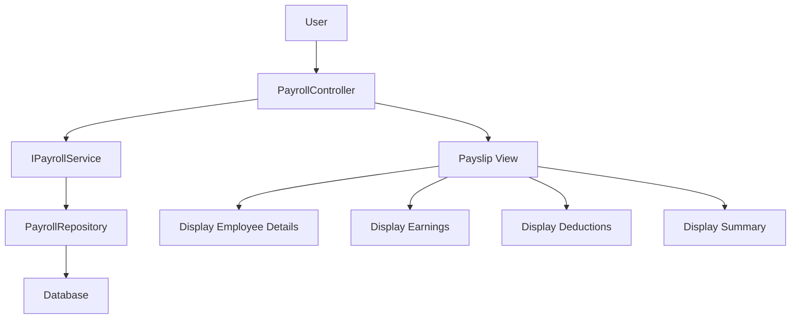

# Payslip Generation - Dynamic Implementation Plan

## Overview
Transform the static HTML payslip template into a dynamic, data-driven view that retrieves employee payroll information from the database.

## Architecture


## Implementation Steps

### Step 1: Create PayslipViewModel
**File**: `src/HRPayroll.Web/Models/PayslipViewModel.cs`

Create a view model that contains all the data needed for the payslip display:
```csharp
public class PayslipViewModel
{
    // Employee Information
    public string EmployeeName { get; set; }
    public string EmployeeCode { get; set; }
    public string Department { get; set; }
    public string Designation { get; set; }
    public DateTime? JoinDate { get; set; }
    
    // Bank Details
    public string BankName { get; set; }
    public string BankAccountNo { get; set; }
    public string BranchName { get; set; }
    
    // Pay Period
    public int Month { get; set; }
    public int Year { get; set; }
    public string MonthName { get; set; }
    public int WorkingDays { get; set; }
    public int DaysPresent { get; set; }
    public int DaysAbsent { get; set; }
    
    // Earnings
    public decimal BasicSalary { get; set; }
    public decimal HouseRentAllowance { get; set; }
    public decimal TransportAllowance { get; set; }
    public decimal MedicalAllowance { get; set; }
    public decimal OvertimeAmount { get; set; }
    public decimal TotalEarnings { get; set; }
    
    // Deductions
    public decimal ProvidentFund { get; set; }
    public decimal TaxDeduction { get; set; }
    public decimal Insurance { get; set; }
    public decimal OtherDeductions { get; set; }
    public decimal TotalDeductions { get; set; }
    
    // Summary
    public decimal GrossSalary { get; set; }
    public decimal NetSalary { get; set; }
}
```

### Step 2: Add Method to IPayrollService Interface
**File**: `src/HRPayroll.Domain/Interfaces/IServices.cs`

Add the new method to the `IPayrollService` interface:
```csharp
Task<PayslipViewModel?> GetPayrollDetailByEmployeeAndMonthAsync(long employeeId, int month, int year);
```

### Step 3: Implement Service Method
**File**: Implementation in Infrastructure layer (e.g., `PayrollService.cs`)

Implement the `GetPayrollDetailByEmployeeAndMonthAsync` method that:
- Retrieves the employee with department and designation
- Retrieves the payroll detail for the specified month/year
- Maps the data to `PayslipViewModel`
- Returns the view model

### Step 4: Add Controller Action
**File**: `src/HRPayroll.Web/Controllers/PayrollController.cs`

Add the `GeneratePayslip` action:
```csharp
// GET: Payroll/GeneratePayslip
public async Task<IActionResult> GeneratePayslip(long? employeeId, int? month, int? year)
{
    // Populate employee dropdown
    var employees = await _employeeService.GetActiveEmployeesAsync();
    ViewBag.Employees = new SelectList(employees, "Id", "FullName");
    
    // Populate month dropdown
    ViewBag.Months = GetMonthList();
    
    // Populate year dropdown
    ViewBag.Years = GetYearList();
    
    if (employeeId.HasValue && month.HasValue && year.HasValue)
    {
        var payslip = await _payrollService.GetPayrollDetailByEmployeeAndMonthAsync(
            employeeId.Value, month.Value, year.Value);
            
        if (payslip == null)
        {
            ViewBag.Error = "No payroll record found for the selected criteria.";
        }
        
        return View(payslip);
    }
    
    return View();
}
```

### Step 5: Create Payslip View
**File**: `src/HRPayroll.Web/Views/Payroll/Payslip.cshtml`

Create the view using the provided HTML template with dynamic data binding:
- Replace hardcoded employee names with `@Model.EmployeeName`
- Replace salary amounts with `@Model.BasicSalary`, `@Model.HouseRentAllowance`, etc.
- Add model binding for the filter dropdowns
- Add form validation

### Step 6: Update Navigation
Add a link to the payslip generation page in the main navigation menu.

## Data Flow
1. User selects employee and month/year from dropdowns
2. Form submits to `GeneratePayslip` action
3. Controller calls service to retrieve payroll data
4. Service retrieves employee, payroll detail, and salary structure data
5. Data is mapped to `PayslipViewModel`
6. View displays the payslip with dynamic data

## Key Files to Modify/Create
1. `src/HRPayroll.Web/Models/PayslipViewModel.cs` - New file
2. `src/HRPayroll.Domain/Interfaces/IServices.cs` - Add interface method
3. `src/HRPayroll.Web/Controllers/PayrollController.cs` - Add action
4. `src/HRPayroll.Web/Views/Payroll/Payslip.cshtml` - Create view

## Notes
- PDF generation and email features are deferred per user request
- The implementation reuses existing domain entities and services
- Uses SelectList for populating dropdowns
- Maintains consistency with existing code patterns
